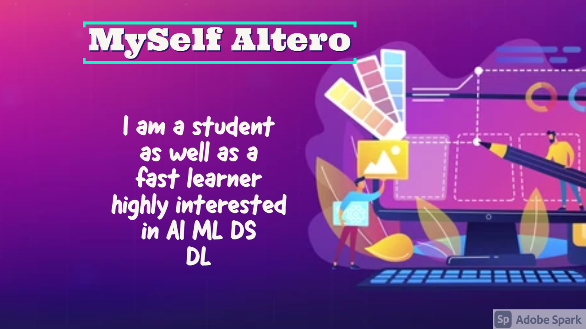

<h3 align="right">

</h3>

<h1 align="center">Hi 👋, I'm Altero</h1>
<h3 align="center">A student who highly interested in AI ML DS DL</h3>

  

  

- 🌱 I’m currently learning **Everything**

- 👨‍💻 All of my projects are available at [https://github.com/A-l-t-e-r-o](https://github.com/A-l-t-e-r-o)

- 💬 Ask me about **AL ML DS DL**

- 📫 How to reach me **venonikadarksider@gmail.com**

- ⚡ Fun fact **I can learn anything fast**

-  📄 Know about my experiences [cooming soon](cooming soon)

<h3 align="left">Connect with me:</h3>

<h3 align="left">Languages and Tools:</h3>

                                               

&nbsp;

<h3 align="right">

</h3>

